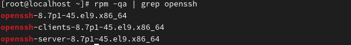
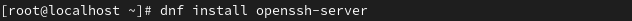
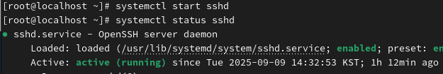
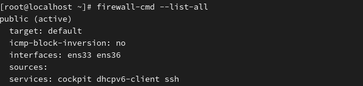
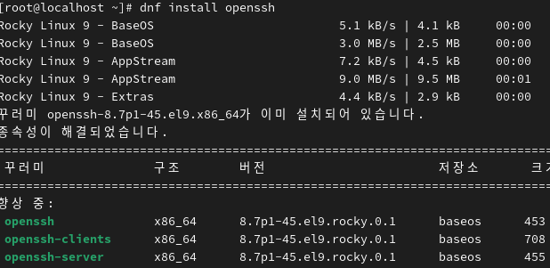
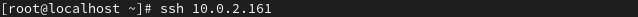

(Secure SHell)  SSH*
 

원격으로 시스템 접속하는 프로그램. 모든 통신을 암호화(telnetSSH)
 
 
 
 
 
 

**
SSH를 이용하기 위해서 서버와 클라이언트가 필요합니다. 

로키리눅스는 SSH 기본 동작. 패키지 가지고 있음 

 

: 없을 경우
 
 
 

1.서버 설치 

2.클라이언트 설치 

3.서버 활성화 및 확인 

4.방화벽 허용 및 확인 

: SSH업데이트 또는 포괄 설치 

*SSH 접속 

