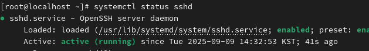
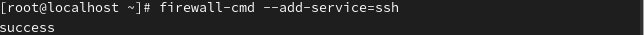
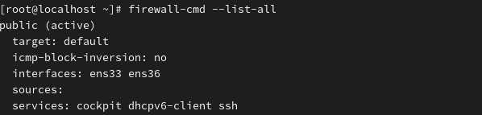
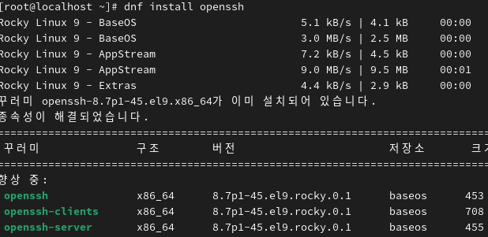

(Secure SHell)  SSH*
 

SSH = A program that allows remote system access with all communications encrypted. 
원격으로 시스템 접속하는 프로그램. 모든 통신을 암호화 (telnet != ssh)
 
 
 
 
 
 

**
To use SSH, both an SSH server and an SSH client are required. 
SSH를 이용하기 위해서 서버와 클라이언트가 필요합니다. 
 
 
 

Rocky Linux has SSH enabled by default and includes the necessary packages. 
로키리눅스는 SSH 기본 동작. 패키지 가지고 있음 

 

: If it is not installed or available. 없을 경우
 
 
 

1.Installing the SSH-Server 서버 설치 

2.Installing the SSH Client 클라이언트 설치 

3.Activating and Verifying the SSH Server 서버 활성화 및 확인 

4.Allowing and Verifying Firewall Access 방화벽 허용 및 확인 

: Updating or Installing SSH PackagesSSH 업데이트 또는 포괄 설치 

*SSH Connection SSH 접속 

