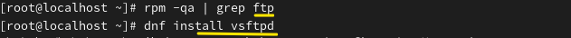
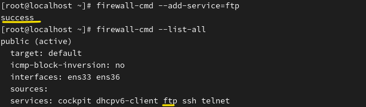
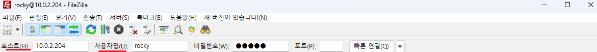
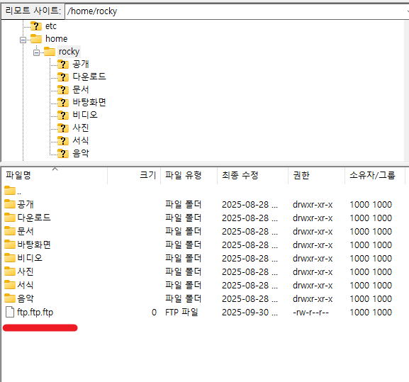
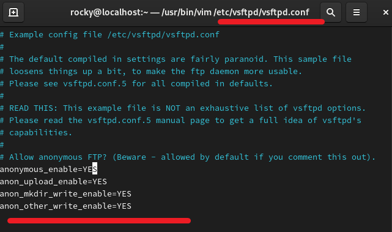

**FTP = File Transfer Protocol
 
 

 
 
Files can be transferred between computers. 
컴퓨터와 컴퓨터 사이 파일을 주고받을 수 있다. 
 
 

 
After searching for the FTP package, no results are displayed. The server will be installed first. 
ftp패키지를 검색한 후 출력된 결과물이 없습니다. 서버부터 설치합니다. 
 

 
Next, the client is installed. 
그 다음 클라이언트를 설치합니다. 
 
 
Installation is complete. 
설치 완료 
 

 
FTP is also allowed through the firewall. 
FTP 방화벽도 허용합니다. 
 
 
 
 

 
Files can be downloaded. 
접속해서 파일을 다운로드 받을 수 있습니다. 

 
 
 

 
 
 
 

FTP main configuration file. command: /etc/vsftpd/vsftpd.conf

FTP 메인 설정 파일 /etc/vsftpd/vsftpd.conf

 
Anonymous connections are permitted. 
익명으로 접속할 수도 있습니다. 
In the server file, the settings sequentially indicate permission for anonymous access, file upload, directory creation, and file deletion. 
서버 파일에서 순서대로 익명 접속 허용, 파일 업로드 허용, 디렉토리 생성 허용, 파일 삭제 권한을 나타냅니다.
