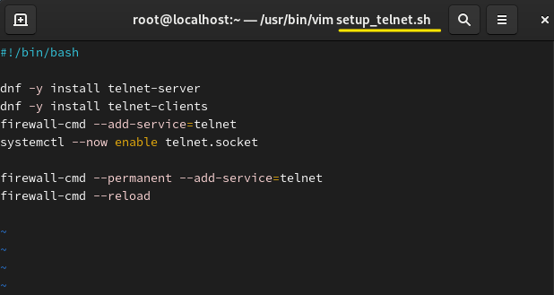
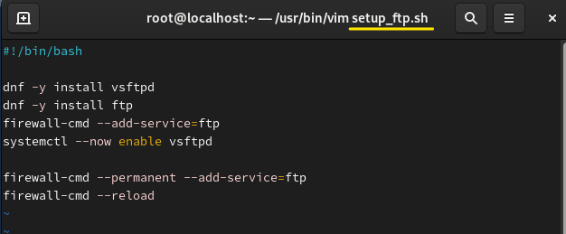
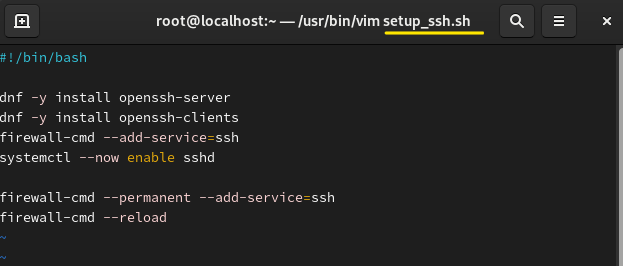

**automation script 
자동화 스크립트 

 
 
 

*Telnet 

 

#!/bin/bash 
dnf -y install telnet-server 
dnf -y install telnet-clients 
firewall-cmd --add-service=telnet 
systemctl --now enable telnet.socket 

firewall-cmd --permanent --add-service=telnet 
firewall-cmd --reload 
 
 

*FTP

 

#!/bin/bash 
dnf -y install vsftpd 
dnf -y install ftp 
firewall-cmd --add-service=ftp 
systemctl --now enable vsftpd 

firewall-cmd --permanent --add-service=ftp 
firewall-cmd --reload 
 
 

*SSH

 

#!/bin/bash 
dnf -y install openssh-server 
dnf -y install openssh-clients 
firewall-cmd --add-service=ssh 
systemctl --now enable sshd 

firewall-cmd --permanent --add-service=ssh 
firewall-cmd --reload 

