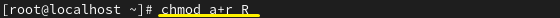
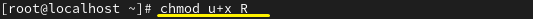
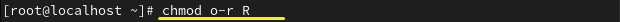
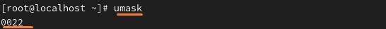

**Chmod  
 

File access permission change command 
파일 접근 권한 변경 명령어 
 
 

ㅡ 리눅스 파일에는 읽기(r),쓰기(w),실행(x) 접근 권한이 있는데 
접근 권한을 2가지로 표현할 수 있습니다. 
 

 

* 문자 & 기호를 이용한 방법 
 

 

모든 사용자(all)에게 읽을 권한(r) 

 

 

 
 

파일 소유자(u)에게만 실행(x) 권한 

 

 

* 8진수 숫자를 이용한 방법 4(r),2(w),1(x)  

 
 
 

**Umask 

 
기본 접근 권한을 변경하여 출력하는 값

umask는 기본적으로 022

 

why-Security 파일의 경우 기본 권한이 666으로 되어있습니다. 생성시에 실행 권한이 없습니다.
666-022=644 이 값으로 파일이 처음 생성될 때 만들어집니다. 

디렉터리의 경우 기본 권한이 777입니다. umask값만큼 빠진 후 생성됩니다.

**special permissions 
특수권한 

##사진

chmod 644 file이라고 했을 때 0이 생략된 0644입니다. 
이때 특수 권한을 앞에 붙여서 4644, 2644, 1644가 될 수 있습니다.  

4  SetUID
파일을 실행할 때 소유자 권한으로 실행합니다.

2  SetGID

파일을 실행할 때 그룹 권한으로 실행합니다.

1 Sticky bit

디렉터리에서 다른 사용자가 파일을 삭제 못합니다. 
##사진

