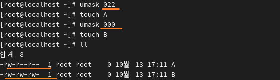
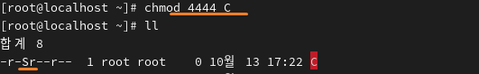
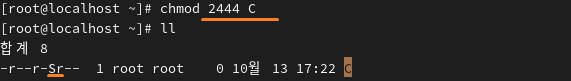
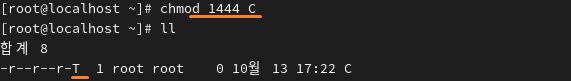

**Chmod  
 

File access permission change command 
파일 접근 권한 변경 명령어 
 
 

Linux files have read (r), write (w), and execute (x) permissions. 
File permissions can be represented in two ways. 

ㅡ 리눅스 파일에는 읽기(r),쓰기(w),실행(x) 접근 권한이 있는데 
접근 권한을 2가지로 표현할 수 있습니다. 
 

 
Using letters & symbols 
* 문자 & 기호를 이용한 방법 
 

 

Read permission (r) for all users (all) 
모든 사용자(all)에게 읽을 권한(r) 

 

 

⬇ ⇩

 

 
 

Execute permission (x) for the file owner (u) only 
파일 소유자(u)에게만 실행(x) 권한 

 

 

Using octal numbers: 4 (r), 2 (w), 1 (x) 
* 8진수 숫자를 이용한 방법 4(r),2(w),1(x)  

 
 
 

**Umask 

The value displayed by changing the default permissions 
기본 접근 권한을 변경하여 출력하는 값 

The default umask is 022 
umask는 기본적으로 022 

 
For the why-Security file, the default permissions are 666. 
666 − 022 = 644, so the file is created with this permission when it is first created. 
why-Security 파일의 경우 기본 권한이 666으로 되어있습니다. 
666-022=644 이 값으로 파일이 처음 생성될 때 만들어집니다.  

 

For directories, the default permission is 777. It is created after subtracting the umask value. 
디렉터리의 경우 기본 권한이 777입니다. umask값만큼 빠진 후 생성됩니다. 
 
 

**special permissions 
특수권한 

4  SetUID 
 
The file is executed with the owner’s permissions. 
파일을 실행할 때 소유자 권한으로 실행합니다. 
 
 
 

2  SetGID 
 
The file is executed with the group’s permissions. 
파일을 실행할 때 그룹 권한으로 실행합니다. 
 
 
 

1 Sticky bit 
 
Other users cannot delete files in the directory. 
디렉터리에서 다른 사용자가 파일을 삭제 못합니다.  
