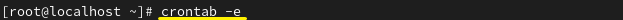
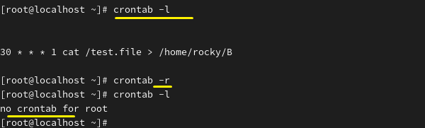
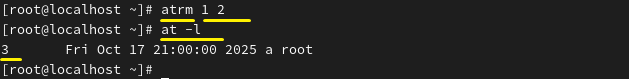
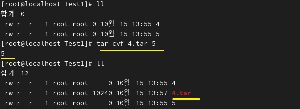
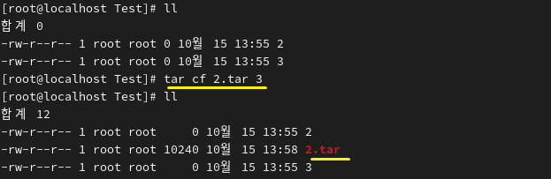
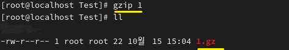
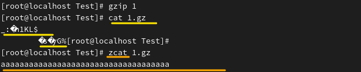
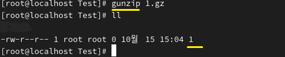

**Cron 
 
 
A system (daemon) that executes scheduled tasks. 
예약된 작업을 실행하는 시스템(데몬) 
 

* Purpose: To automatically execute tasks at scheduled times. 
* 목적:정해진 시간에 작업을 자동으로 실행하기 위함 
 
 
 

Tasks are scheduled in crontab and edited using -e. 
crontab에 작업 예약을 합니다. -e로 편집합니다. 

 
 
 

 
Minute, hour, day, month, weekday, command  
the task follows this format, executing the command every Monday at 30 minutes past the hour. 

분&nbsp;&nbsp;&nbsp;&nbsp;&nbsp;&nbsp;&nbsp;&nbsp;&nbsp;시&nbsp;&nbsp;&nbsp;&nbsp;&nbsp;&nbsp;&nbsp;&nbsp;&nbsp;일&nbsp;&nbsp;&nbsp;&nbsp;&nbsp;&nbsp;&nbsp;&nbsp;월&nbsp;&nbsp;&nbsp;&nbsp;&nbsp;&nbsp;요일&nbsp;&nbsp;&nbsp;	    명령어 
0-59&nbsp;&nbsp;&nbsp;&nbsp;0-23&nbsp;&nbsp;&nbsp;&nbsp;1-31&nbsp;&nbsp;&nbsp;&nbsp;1-12&nbsp;&nbsp;&nbsp;&nbsp;0-6&nbsp;&nbsp;&nbsp;&nbsp;&nbsp;&nbsp;&nbsp;&nbsp;&nbsp;cat - 
 
작업 형식은 이 순서로, 매주 월요일 30분마다 명령어를 실행합니다. 
 
 

 
Listing is done with -l, and deletion with -r. 
확인은 -l로 하며 삭제는 -r로 합니다. 
 
 

 
 

* at: Executes a task once at a specified time. 
* at : 정해진 시간에 한 번 실행 

 
Execute the task at 9 PM, three days from now. 
지금부터 3일 뒤, 저녁 9시 작업 실행 

 
at jobs are stored in the corresponding directory. 
at은 해당 경로에 저장됩니다.

 

They can be listed with -l (at -l = atq). 
확인은 -l로 할 수 있습니다(at -l = atq) 
 

It can be deleted using atrm. 
atrm을 이용해 삭제할 수 있습니다. 

 

 
 
 
 

**Archive & Compression 
아카이브 & 압축 

* tar(Tape Archive)
File archive: Combining multiple files into a single one. 
파일 아카이브 : 파일을 묶어서 하나로 만드는 것 
 
 
c - create 압축 
f - file 다음 파일 이름으로  
x - extrace, 해제 
v - verbose, 상세보기  
 
Archiving can be done using cvf or cf. 
cvf 또는 cf를 이용해 아카이브를 할 수 있습니다. 

 
 

 
 
 
 

* Compression 압축 
There are various types, with gzip and bzip2 being open-source and offering relatively high compression. 
여러 종류가 있지만 오픈 소스이면서, 압축률이 상대적으로 좋은 gzip과 bzip2를 살펴보겠습니다. 

 
When compressed with gzip, file 1 becomes 1.gz, indicating the .gz extension. 
If compressed with bzip2, the extension becomes .bz2. 
압축 방식이 gzip으로 1을 압축했을 때 1.gz가 생깁니다. 확장자가 .gz임을 알 수 있습니다. 
만약 bzip2으로 압축을 하면 확장자는 .bz2입니다. 
 
 
 
 

 
Compressed files are binary and cannot be read directly. 
zcat can be used to view the original text. 
압축을 한 파일을 보면 바이너리이므로 읽을 수가 없습니다. 
이때, zcat으로 원래 텍스트를 볼 수 있습니다. 
 
 
 

 
gzip can be decompressed with gunzip or gzip -d. 
For bzip2, use bunzip2 or bzip2 -d. 
gzip 해제는 gunzip으로 합니다. 또는 gzip -d입니다.  
bzip2면, bunzip2 또는 bzip2 -d로 풀 수 있습니다. 
 
 

*최신 버전으로 zstd가 있습니다.

The Penetration Testing — Bandit — Level 12 walkthrough can be referenced. 
Penetration Testing-Bandit-Level 12단계를 참고할 수 있습니다. 
 
