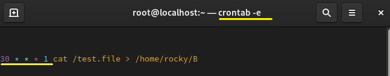
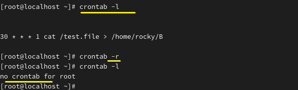
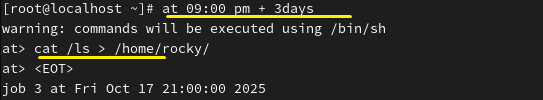
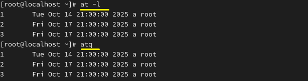
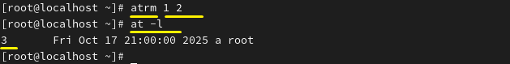

**Cron 
 
 
예약된 작업을 실행하는 시스템(데몬)

* 목적:정해진 시간에 작업을 자동으로 실행하기 위함 
 
 
 

crontab에 작업 예약을 합니다. -e로 편집합니다. 

 
 
 

 

분&nbsp;&nbsp;&nbsp;&nbsp;&nbsp;&nbsp;&nbsp;&nbsp;&nbsp;시&nbsp;&nbsp;&nbsp;&nbsp;&nbsp;&nbsp;&nbsp;&nbsp;&nbsp;일&nbsp;&nbsp;&nbsp;&nbsp;&nbsp;&nbsp;&nbsp;&nbsp;월&nbsp;&nbsp;&nbsp;&nbsp;&nbsp;&nbsp;요일&nbsp;&nbsp;&nbsp;	    명령어 
0-59&nbsp;&nbsp;&nbsp;&nbsp;0-23&nbsp;&nbsp;&nbsp;&nbsp;1-31&nbsp;&nbsp;&nbsp;&nbsp;1-12&nbsp;&nbsp;&nbsp;&nbsp;0-6&nbsp;&nbsp;&nbsp;&nbsp;&nbsp;&nbsp;&nbsp;&nbsp;&nbsp;cat - 
 
작업 형식은 이 순서로, 매주 월요일 30분마다 명령어를 실행합니다.

 

확인은 -l로 하며 삭제는 -r로 합니다. 
 
 

* at : 정해진 시간에 한 번 실행 

 

지금부터 3일 뒤, 저녁 9시 작업 실행

 

at은 해당 경로에 저장됩니다.

 

확인은 -l로 할 수 있습니다(at -l = atq) 
 

atrm을 이용해 삭제할 수 있습니다. 

 

 
 
 
 

**Archive & Compression 
아카이브 & 압축

파일 아카이브 : 파일을 묶어서 하나로 만드는 것

tar(Tape Archive)

tar 파일 묶기
xz, bz2, gz 등으로 압축
각 알고리즘 별로 명령어 옵션이 달라짐
J - xz
j - bz2
z - gz
c - create, 압축 하기
f - 다음 파일 이름으로 압축하기(필수)
x - extract, 압축 해제제

