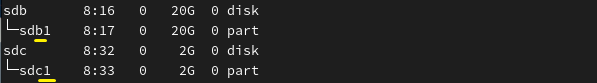
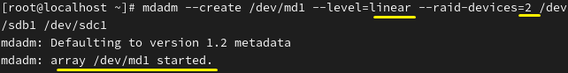
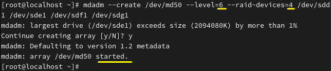
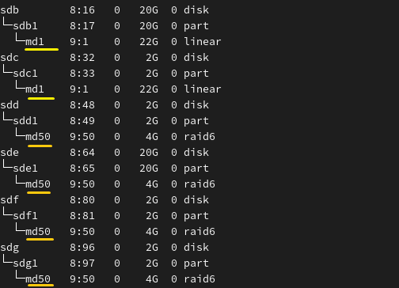
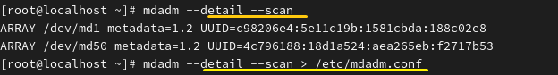
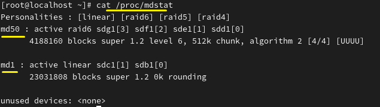
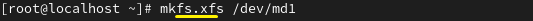
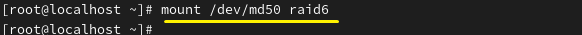
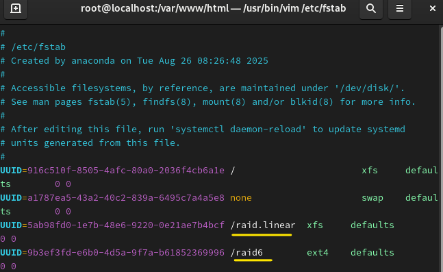

**RAID 
 
A technology that combines multiple disks into a single device to improve performance and protect data. 
디스크를 하나의 장치를 묶어 성능 향상 및 데이터를 보호하는 기술 
 
 

RAID-Level&nbsp;&nbsp;&nbsp;&nbsp;&nbsp;&nbsp;&nbsp;&nbsp;&nbsp;Minimum number of disks&nbsp;&nbsp;&nbsp;&nbsp;&nbsp;&nbsp;&nbsp;&nbsp;&nbsp;&nbsp;&nbsp;&nbsp;&nbsp;Advantages 

Linear   	&nbsp;&nbsp;&nbsp;&nbsp;&nbsp;&nbsp;&nbsp;&nbsp;&nbsp;&nbsp;&nbsp;&nbsp;&nbsp;&nbsp;&nbsp;&nbsp;&nbsp;&nbsp;&nbsp;&nbsp;&nbsp;&nbsp;&nbsp;&nbsp;1&nbsp;&nbsp;&nbsp;&nbsp;&nbsp;&nbsp;&nbsp;&nbsp;&nbsp;   &nbsp;&nbsp;&nbsp;&nbsp;&nbsp;&nbsp;&nbsp;&nbsp;&nbsp;     Combined capacity 
RAID 0	 &nbsp;&nbsp;&nbsp;&nbsp;&nbsp;&nbsp;&nbsp;&nbsp;&nbsp;&nbsp;&nbsp;&nbsp;&nbsp;&nbsp;&nbsp;&nbsp;&nbsp;&nbsp;&nbsp;&nbsp;&nbsp;&nbsp;2	     &nbsp;&nbsp;&nbsp;&nbsp;&nbsp;&nbsp;&nbsp;&nbsp;&nbsp;     &nbsp;&nbsp;&nbsp;&nbsp;&nbsp;&nbsp;&nbsp;&nbsp;&nbsp;   Performance improvement 
RAID 1           &nbsp;&nbsp;&nbsp;&nbsp;&nbsp;&nbsp;&nbsp;&nbsp;&nbsp;&nbsp;&nbsp;&nbsp; &nbsp;&nbsp;&nbsp;&nbsp;&nbsp;&nbsp;&nbsp;&nbsp;&nbsp;2 	    &nbsp;&nbsp;&nbsp;&nbsp;&nbsp;&nbsp;&nbsp;&nbsp;&nbsp;    &nbsp;&nbsp;&nbsp;&nbsp;&nbsp;&nbsp;&nbsp;&nbsp;&nbsp;   Data protection (mirroring) 
RAID 5        &nbsp;&nbsp;&nbsp;&nbsp;&nbsp;&nbsp;&nbsp;&nbsp;&nbsp;&nbsp;&nbsp;&nbsp;&nbsp;&nbsp;&nbsp;&nbsp;&nbsp;&nbsp;&nbsp;&nbsp;&nbsp;&nbsp;3	      &nbsp;&nbsp;&nbsp;&nbsp;&nbsp;&nbsp;&nbsp;&nbsp;&nbsp;    &nbsp;&nbsp;&nbsp;&nbsp;&nbsp;&nbsp;&nbsp;&nbsp;&nbsp;  High capacity efficiency 
RAID 6           &nbsp;&nbsp;&nbsp;&nbsp;&nbsp;&nbsp;&nbsp;&nbsp;&nbsp; &nbsp;&nbsp;&nbsp;&nbsp;&nbsp;&nbsp;&nbsp;&nbsp;&nbsp;&nbsp;&nbsp;&nbsp;4	       &nbsp;&nbsp;&nbsp;&nbsp;&nbsp;&nbsp;&nbsp;&nbsp;&nbsp;   &nbsp;&nbsp;&nbsp;&nbsp;&nbsp;&nbsp;&nbsp;&nbsp;&nbsp;  Data protection (2 disks) 
RAID 10          &nbsp;&nbsp;&nbsp;&nbsp;&nbsp;&nbsp;&nbsp;&nbsp;&nbsp;&nbsp; &nbsp;&nbsp;&nbsp;&nbsp;&nbsp;&nbsp;&nbsp;&nbsp;&nbsp;4	       &nbsp;&nbsp;&nbsp;&nbsp;&nbsp;&nbsp;&nbsp;&nbsp;&nbsp;   &nbsp;&nbsp;&nbsp;&nbsp;&nbsp;&nbsp;&nbsp;&nbsp;&nbsp; Data protection + performance improvement (mirroring + striping) 

 
 
 
 

First, the RAID level is Linear. The minimum number of disks is 1. 
*Why – however, for technical reasons, it is usually used with at least 2 disks. 
먼저 RAID 레벨 Linear입니다. 최소 디스크 수가 1개입니다. 
*Why-하지만, 기술적인 의미를 위해 보통 2개부터 사용합니다. 

 

First, create the partition. 
먼저 파티션을 생성합니다. 
 
 
 

 
This is the command to create a RAID device. Fill in the items according to the RAID requirements, and md(x)—where x is arbitrarily set by the user. 
RAID 장치 생성 명령어입니다. RAID 조건에 맞게 항목을 써주고 md(x) x는 사용자 임의 설정입니다.  

 
The RAID level is 6. The same process can be followed. 
레벨 6입니다. 같은 과정으로 할 수 있습니다. 

 

 
 

Command : lsblk

 
The RAID status can be checked. 
RAID 잘 된 걸 볼 수 있습니다. 

 
 
 
 
This is a summary of all RAID devices. 
RAID 전체 장치 요약입니다. 

 
If sent to /etc/mdadm.conf, it is saved on the disk and activated at boot.
/etc/mdadm.conf로 보내면 디스크에 저장되어, 부팅시에 활성화 됩니다.  
 
 
 

 
Additionally, the RAID status can be viewed in real time using this command. 
또한, 해당 명령어를 이용해 실시간 RAID 상태를 볼 수 있습니다. 
 
 
 
 
 

 

 

 
Proceed with the mounting steps (step 9): format the disk, create the mount point, and mount it. 
마운트하는 과정대로(step9) 포맷과 마운트 포인트 생성 후 마운트합니다. 
 
 
 
 
 

vi /etc/fstab

 
If the mount point and format type are saved correctly,  
the configuration itself is stored on the disk, and the RAID device is automatically mounted at boot. 
형식에 맞게 마운트 포인트 및 포맷 형식을 설정하면, 
설정 자체가 디스크에 저장되어 부팅시, 자동으로 RAID장치를 마운트합니다. 
 
 >
The commands df -hT and blkid can be used. 
df -hT 및 blkid를 활용할 수 있습니다. 

메타데이터 - 레이드 구성 정보를 디스크에 담고 있는 구간

