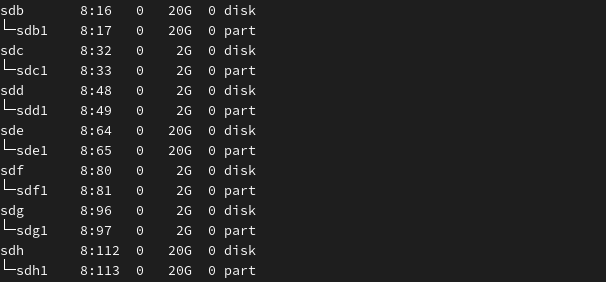
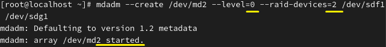

**Advanced RAID 
 

*RAID 5+0(=RAID 50) 
 
RAID5+0 필요 디스크 수 6개 

 

 
 
 
5+0은 먼저 RAID5 배열 먼저 묶은 후, RAID0 배열로 묶어야 합니다. 
 

 

RAID5 배열로 먼저 묶습니다. 
 
 

 

마찬가지로 RAID5 배열로 묶습니다. 

 
 
 

 

묶인 RAID5를 RAID0으로 묶습니다. 
 
 
 

 

 
 
 

*RAID 0+5 (RAID 05) 
 

표준은 아니지만, 이론상 가능합니다. 
0+5의 필요 디스크 수는 6개입니다. 
 
 

 
RAID0 배열 먼저 묶은 후, RAID5 배열로 묶어야 합니다. 

 

 

 

RAID0으로 전부 묶였고, 묶인 것들을 RAID5로 묶습니다.

 

 

