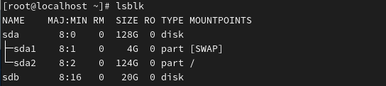
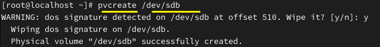
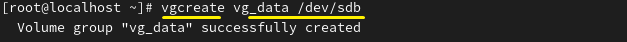
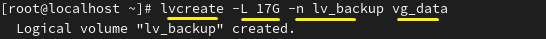
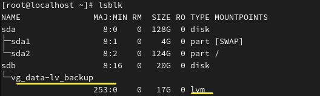
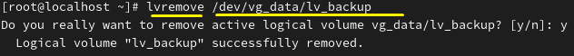
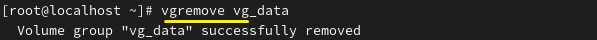
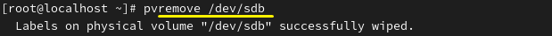
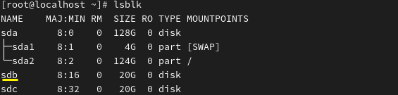

**LVM 

A system that manages disk space flexibly. 
디스크 공간을 유연하게 관리하는 시스템 
 
 

* Process 
* 과정 
 

Physical disk → PV → VG → LV → (Filesystem → Mount) 

물리 디스크 → PV → VG → LV → (파일시스템 → 마운트)  
 
 
 

lsblk

 

 
 

 
pvcreate is the step that prepares a disk for use as an LVM physical volume (PV). 
pvcreate 디스크를 LVM으로 준비하는 단계 
 
 

 
(Volume Group, VG) 

vgcreate vg_data /dev/sdb 
 
 

 
Create a Logical Volume (LV) in vg_data with absolute size -L 17GB and name -n lv_backup 
논리 볼륨 생성 (Logical Volume, LV) 
절대용량 -L 17GB, 이름 -n lv_backup을 vg_data에 생성 
 
 

 
It is possible to check/verify the LVM configuration. 
lvm을 확인할 수 있습니다.

 
 
 

* Lvm Remove 
 

It can be performed in the reverse order of the creation process. 
과정의 반대로 진행하면 됩니다. 
 
 

 
LV Remove 
 

 
VG Remove  
 

 
PV Remove 
 

 
Deletion completed. 
삭제 완료 

