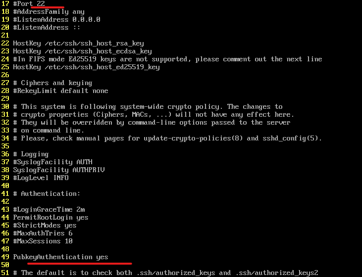

**SSH-keygen

Public keys are more secure and convenient than passwords (using the RSA encryption method). 
공개키는 비밀번호보다 안전하며 편리합니다.(RSA 암호화 방식) 
 
 
 

 

Passphrase required with a compromised private key — can be omitted (weakening security). 
개인키 유출시 같이 입력해야하는 암호. 생략 가능(보안 약화) 

 
Verify the locations of the public and private key files. 
공개 및 개인 키 파일 확인 

 
Public key transfer command: ssh-copy-id user@<server_IP> 
공개키 전달 명령어 : ssh-copy-id user@서버 IP  

 
It can be confirmed that the public key has been sent. 
공개키가 보내진 걸 알 수 있습니다.

 
SSH 접근 제어
vi /etc/ssh/sshd_config  
들어가서 설정을 해야합니다.

 
It can be confirmed that the default port is 22, and it is changed to allow public key authentication. 
기본 포트가 22번인 걸 확인할 수 있으며, 공개키 허용으로 바꿔줍니다.

 
This determines whether root login and password-based login are allowed. 
루트로 로그인 허용과 비밀번호 입력으로 로그인 허용 여부입니다. 

*Save and exit in vi. 
vi 저장 후 나가기 
Esc 
:wq = :x

 

위에서 설정했던대로 rocky로 로그인시 공개키로 로그인 됐습니다.

firewall-cmd --add-port=50001/tcp

Rocky 9 SSHD 설정 파일 변화
/etc/ssh/sshd_config.d
설정을 일부분 떼어서 추가적으로 보관

root로 원하는 유저에게 sudo 권한 부여
visudo
111행
4gl   ALL=(ALL)   NOPASSWD: ALL
(vi에서 행 번호를 출력
:set number
:set nu
)

