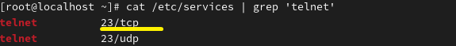
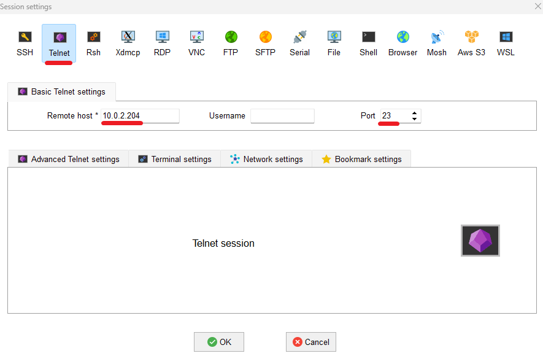
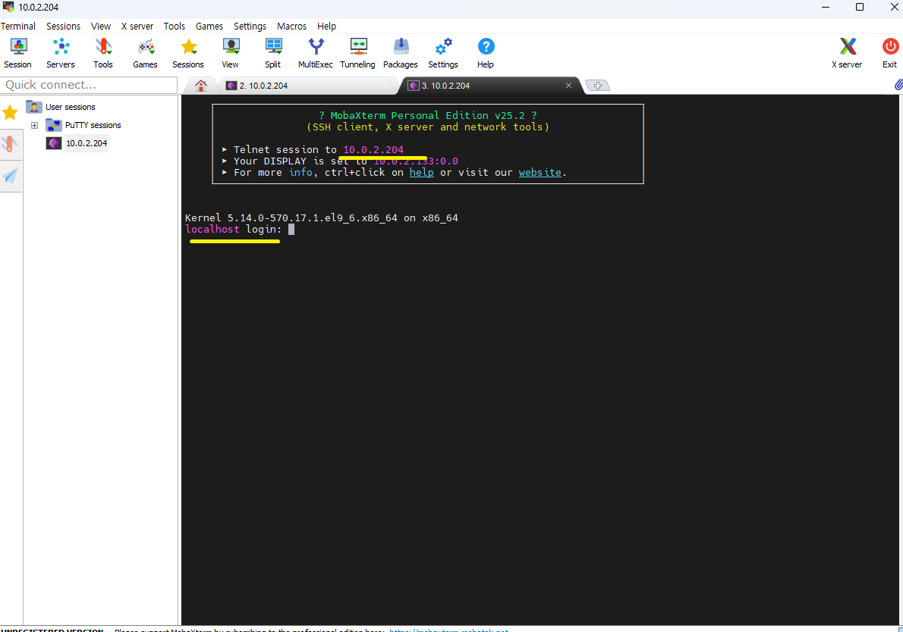
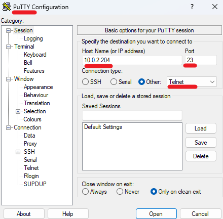
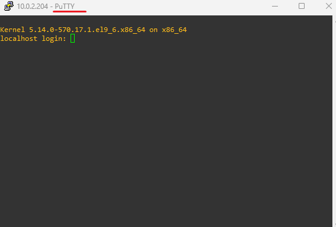

** MobaXterm & PuTTy 
 
 
Program for accessing network devices. 
네트워크 장비 접속 프로그램 
 
 

 
Telnet is known to use port 23 by default. 
telnet은 기본적으로 23번 포트를 사용하는 걸 알 수 있습니다. 
 
 

 
MobaXterm supports it along with SSH and other protocols. 
MobaXterm입니다. telnet뿐만 SSH등 다양한 프로토콜을 이용할 수 있습니다.  
 
 

 
After logging in, Telnet can be accessed. 
로그인 후 텔넷에 접속하면 됩니다.  
 

 
PuTTY allows connection to Telnet and is advantageous for its fast startup. 
PuTTY를 이용하여 telnet에 접속할 수 있습니다. 실행이 빠른 게 장점입니다. 
 
 

 

