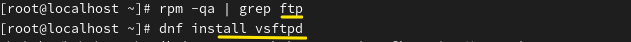
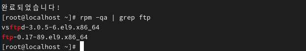
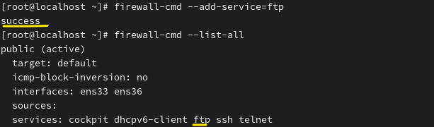

**FTP
 
 

 
After searching for the FTP package, no results are displayed. The server will be installed first. 
ftp패키지를 검색한 후 출력된 결과물이 없습니다. 서버부터 설치합니다. 
 

 
Next, the client is installed. 
그 다음 클라이언트를 설치합니다. 
 
 
Installation is complete. 
모두 설치가 완료됐습니다. 
 

 
FTP is also allowed through the firewall. 
ftp 방화벽도 허용합니다. 
 
 
 
 

FileZilla 설치 후 구축한 FTP 서버에 접속

파일 생성 스크립트 만들기

touch pathandfile.sh

#!/bin/bash → 셔뱅(shebang) : 쉘 스크립트에서 어떠한 쉘을 통해 프로그래밍 할 지 정하는 선언

다운로드

i /etc/vsftpd/vsftpd.conf

12 anonymous_enable=YES
변경
익명 접속 허용

*vi 저장하지 않고 나가기

/sbin/nologin - 해당 구문이 설정된 유저는 로그인이 불가능하며 시스템에서만 사용

#anon_upload_enable=YES
익명 유저 업로드 허용 시 # 제거

#anon_mkdir_write_enable=YES
익명 유저 디렉터리 생성 허용 시 # 제거

systemctl stop vsftpd
systemctl start vsftpd

익명 삭제 권한 추가(가장 아래 쪽에 추가)
anon_other_write_enable=YES
