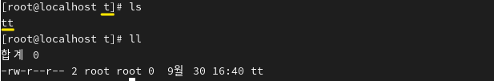
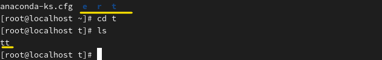
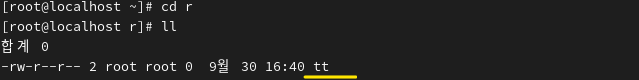
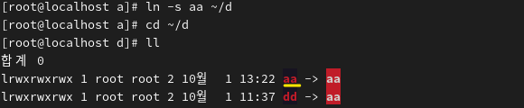

** LINK

파일 = 파일명 + inode + 데이터 블록으로 구성

링크의 종류 : 하드 링크, 심볼릭 링크(소프트 링크) 
 
 

ㅡ 하드 링크란 A라는 원본 파일을 똑같이 하나 더 만드는 것입니다. 
원본 파일이 삭제해도 만들어진 파일을 읽을 수 있습니다.

ㅡ 심볼릭 링크는 원본 파일 경로를 가리키는 바로가기라, 
원본이 사라지면 접근할 수 없습니다. 읽을 수 없습니다. 
 

 

t의 tt파일이 있습니다.

 

디렉토리 e r t 중 t의 tt파일을 각각 e r에 링크 설정하겠습니다. 

 

r에는 하드링크 설정합니다.

 

why-하드링크이므로 t의 파일과 같습니다.

 

e에는 심볼릭 링크 설정합니다.

 

