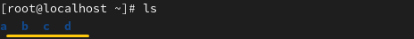
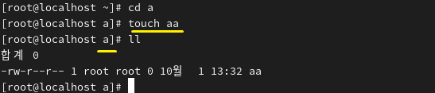
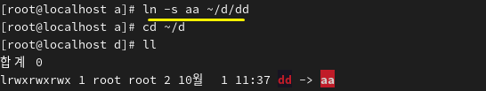

** LINK 
 
A file = filename + inode + data blocks.
파일 = 파일명 + inode + 데이터 블록으로 구성

링크의 종류 : 하드 링크, 심볼릭 링크(소프트 링크) 
 
 

ㅡ A hard link is creating an exact duplicate of an original file, such as file A. 
ㅡ 하드 링크란 A라는 원본 파일을 똑같이 하나 더 만드는 것입니다. 

ㅡ A symbolic link is a shortcut that points to the path of the original file. 
ㅡ 심볼릭 링크란 원본 파일 경로를 가리키는 바로가기입니다. 
 

 
The current directory contains: a, b, c, d. 
현재 디렉토리가 a b c d 이렇게 있습니다.

 
 

 
A file named aa was created in the a directory. This is the original. 
a 디렉토리에 파일 aa를 만들었습니다. 원본입니다.

 
 

* 하드링크 
 

 
A hard link was created in the b directory, resulting in the same file. 
Reason: The data is shared, so changes to the original are reflected in the hard link. 
The red number indicates the original plus the number of hard links. 

b 디렉토리에 하드링크를 만들었습니다. 같은 파일이 생겼습니다.  
why?-데이터를 공유하기 때문에, 원본이 내용을 바꿔도 하드링크 내용은 원본과 같습니다. 
빨간색은 원본 + 하드링크 개수입니다. 
 

Even if the original file is deleted, the created file can still be read. 
원본 파일이 삭제해도 만들어진 파일을 읽을 수 있습니다. 

 
 

* 심볼릭 링크 
 

 
A link named dd was created in the d directory, pointing to aa. 
As a result, a file named dd was generated. 
Reason: Since there was no file named dd in the d directory, it was created.** 

aa를 d 디렉토리에 dd라는 이름으로 링크를 걸었습니다. dd라는 파일이 생기면서 aa를 가리킵니다. 
why?-바로가기. 이때, d 디렉토리에는 dd라는 파일이 없기 때문에 만들어졌습니다. 

 
 

 
This time, a link to aa was created in the b directory, resulting in aa → aa. 
이번엔, aa를 b 디렉토리에 링크를 걸어서 aa > aa가 나타났습니다. 

Reason: A symbolic link is only a shortcut. If the original is deleted, it cannot be accessed or read. 
why?-바로가기. 원본이 사라지면 접근할 수 없습니다. 읽을 수 없습니다. 

