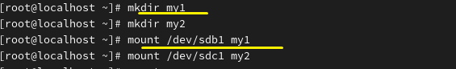

**mount 
 
Mounting is connecting a computer so that it can read and write files on a USB drive or hard disk. 
*컴퓨터가 USB나 하드디스크 안에 있는 파일을 읽고 쓸 수 있도록 연결하는 것 
 
 

*Four steps to mount 
과정 4단계 
 
 

1. Disk is checked 디스크 확인

 
There are disks sdb and sdc. 
디스크 sdb, sdc가 있습니다. 
 

2. Partition is created 파티션 생성

 
For disk sdb, a partition is created first, and after creation, it must be saved using the write (w) command. 
먼저 sdb 파티션을 생성하는데, 생성 후 꼭 저장(w)을 해야합니다.
 
 

 
For disk sdc, a partition is also created. 
디스크 sdc도 파티션 생성합니다. 
 

 
Partitions sdb1 and sdc1 have been created. 
sdb1, sdc1 파티션이 생성됐습니다. 
 
 

3. File system is created 파일시스템 생성

 
A file system (format) must be created on the newly created partitions. 
생성된 파티션에 파일 시스템(포맷)을 생성해야 합니다. 

There are four types of file systems: ext2, ext3, ext4, and xfs. 
Modern Linux primarily uses ext4, while xfs is employed for large-capacity or specialized use cases. 
파일 시스템은 ext2, ext3, ext4, xfs 4종류가 있습니다. 
최신 리눅스는 etx4를 주로 이용하며 대용량 같은 용도에 따라서 xfs를 이용합니다. 

The commands are as follows: mkfs -t ext4 or mkfs.ext4 for ext4, and mkfs.xfs for xfs. 
명령어는 각각 mkfs -t ext4 = mkfs.ext4 / mkfs.xfs입니다.

 
It is possible to verify that each file system has been applied correctly. 
각각 파일시스템에 맞게 적용된 걸 볼 수 있습니다. 
 
 
 

4. Mounting is performed 마지막 단계 

 
Before mounting, a directory is created to serve as the mount point. The mount point is a directory. 
마운트 하기 전에 어디에 마운트 할 건지 디렉토리를 만듭니다. 마운트 포인트는 디렉토리입니다. 

ㅡ vi /etc/fstab

 
 
*completed 
완료
