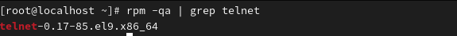
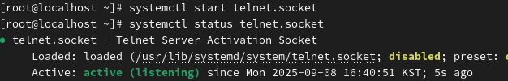
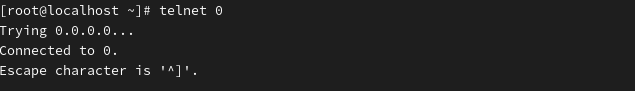
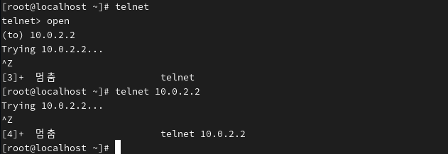

Telnet*
 

Name of the program that remotely accesses Linux or network equipment  
원격으로 리눅스 또는 네트워크 장비에 접속하는 프로그램 이름

 
 

**To use Telnet, both a Telnet server and a Telnet client are required. 
텔넷을 이용하기 위해 텔넷 서버와 클라이언트가 필요합니다.

 
* first, check the telnet package
  -----텔넷 패키지 확인

  
 
: If it’s related to Telnet  
텔넷 관련 있을 경우

  
 
 
1.Installing the Server 서버설치 

 
 
 
2.Installing the Telnet Client 클라이언트설치  

 
 
 
3.Enabling and Verifying the Server 서버 활성화 및 확인 
  
why-systemctl > controlling systemd > daemon(Server)
 
 
 
4.Allowing and Verifying Firewall Access 방화벽 허용 및 확인 

 
 
 
5.Attempting a Connection 연결 시도 (0 = local) 

 

