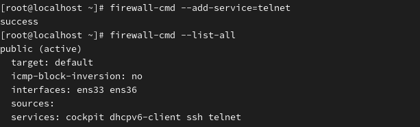

Telnet*

Name of the program that remotely accesses Linux or network equipment

원격으로 리눅스 또는 네트워크 장비에 접속하는 프로그램 이름

 
 

**To use Telnet, both a Telnet server and a Telnet client are required. 

텔넷을 이용하기 위해 텔넷 서버와 클라이언트가 필요합니다.

 
* first, check the telnet package
  -----텔넷 패키지 확인

  
 

: 텔넷 관련 있을 경우

  
 
1.서버설치

 
 
2.클라이언트설치 

 
 
3.서버 활성 및 확인

 
 
4.방화벽 허용 및 확인

 
 
5.연결 시도 (0=local)

 

