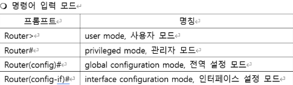

** The Importance of a Router 라우터의 중요성 
 

Accessing a Router via CLI (Command-Line Interface)라우터 입력 방법 

Command-Line Mode (Router CLI) 
  

 
 
 

  

en: enable 
conf t: configure terminal 
int f0/1: interface fastethernet0/1 
ip add(r) : ip address + IP + MASK 
no sh: no shutdown (Activation) 
sh ip int br : show ip interface brief 

  

If you entered the wrong IP address
