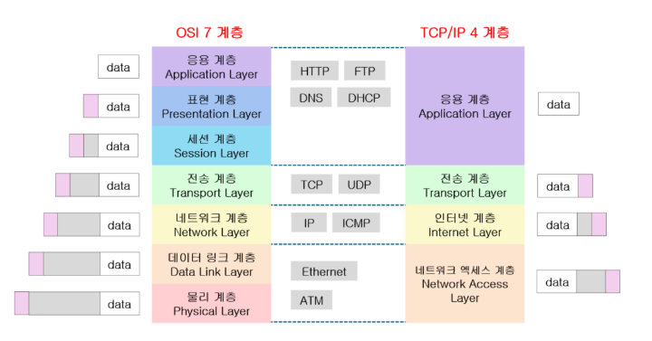

(출처)

**OSI 7 Layers 

  
ISO proposed the OSI model to standardize network communications by dividing them into seven layers.

1.Physical Layer: Converts bits (0s and 1s) into electrical signals or light for transmission. 
0과 1 같은 비트를 전기 신호나 빛으로 바꿔서 전송

2.Data Link Layer: Groups bits into frames, performs error checking, and identifies devices using MAC addresses. 
비트를 묶어 프레임으로 만들고, 오류 검사와 장치(MAC) 식별

3.Network Layer: Routes packets based on IP addresses and delivers them via the optimal path. 
패킷 단위로 IP 주소를 보고 최적 경로로 전달

4.Transport Layer: Divides data into segments/datagrams and ensures reliable delivery (TCP/UDP). 
데이터를 세그먼트/데이터그램으로 나누어 신뢰성 있게 전달

5.Session Layer: Establishes, maintains, and manages communication sessions between computers. 
컴퓨터 간 통신 연결을 만들고 유지하며 관리

6.Presentation Layer: Formats data and performs encryption/compression. 
데이터 형식을 맞추고 암호화/압축 수행

7.Application Layer: Handles network connections for user-facing programs (web, email, file transfer, etc.). 
사용자가 직접 쓰는 프로그램과 네트워크 연결 담당 (웹, 이메일, 파일 전송 등)
