**ipv6 
 
1. 맨 앞 자리 0은 생략 가능합니다. 
2. 0으로 채워진 비트는 :으로 생략 가능합니다. 

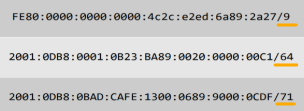

ㅡ 9비트까지만 prefix로 사용합니다. 
앞에 8비트는 빼고, 9비트를 포함하는 자리 16진수 8이 현재 4비트입니다. 
2진수로 변경해서 1000에서 첫 번째 비트를 가져오면 1000 8이됩니다. fe80::/9 
 

ㅡ 64비트 절반을 prefix로 사용합니다. 
2001:DB8:1:B23::/64 
 

ㅡ 71비트를 prefix로 사용합니다. 
앞에 68비트 빼고, 나머지 3비트를 포함하는 16진수 3이 현재 4비트입니다. 
2진수로 변경해서 3비트를 채워주면, 0011에서 세 번째 비트까지 채우면 2001:DB8:BAD:CAFE:1200::/71 
 
 

* ipv6 입력 방법
* ipv6 입력 방법

 
 
 

(GNS3)

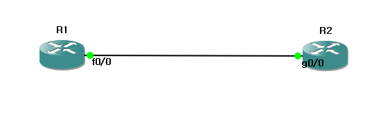 

라우터가 2개 있습니다. 
 
 
 

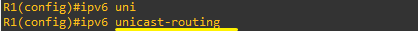 

*Why-기본이 ipv4입니다. 
ipv6 등록이 필요합니다. 유니캐스트를 기본으로 사용합니다. 

 
 
1. 
 

&nbsp;&nbsp;&nbsp;&nbsp;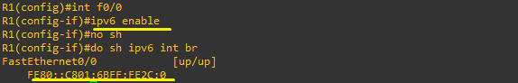 

enable을 이용해 자동으로 로컬 주소를 생성할 수 있습니다. 
로컬 주소는 같은 네트워크 안에서만 통신이 가능합니다. 

&nbsp;&nbsp;&nbsp;&nbsp; 

R2도 똑같이 ipv6 주소 생성 후, ping을 보내고 인터페이스를 입력해야 합니다.. 

&nbsp;&nbsp;&nbsp;&nbsp;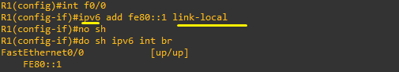 

같은 로컬 주소를 생성하는데, 이번엔 수동으로 입력하는 방법입니다. 

&nbsp;&nbsp;&nbsp;&nbsp;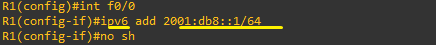 

&nbsp;&nbsp;&nbsp;&nbsp;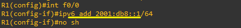 

&nbsp;&nbsp;&nbsp;&nbsp;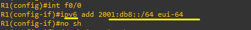 

&nbsp;&nbsp;&nbsp;&nbsp;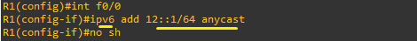 

&nbsp;&nbsp;&nbsp;&nbsp;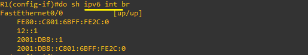 

&nbsp;&nbsp;&nbsp;&nbsp;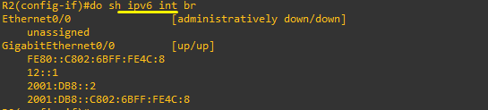 

&nbsp;&nbsp;&nbsp;&nbsp;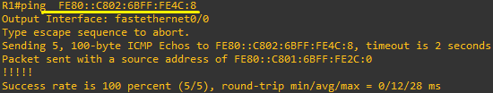 

&nbsp;&nbsp;&nbsp;&nbsp;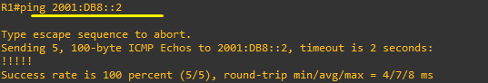

&nbsp;&nbsp;&nbsp;&nbsp;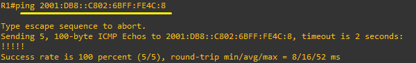

&nbsp;&nbsp;&nbsp;&nbsp;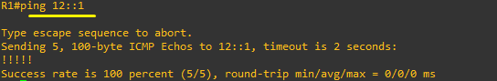

