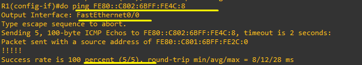

**ipv6 
 
 
Leading zeros can be omitted. 
Bits filled with zeros can be compressed using :: 
맨 앞 자리 0은 생략 가능합니다. 
0으로 채워진 비트는 : 으로 생략 가능합니다. 
 
 
 
 
IPv6 prefix exercise 

 
 
ㅡ Only the first 9 bits are used as the prefix. 
Excluding the first 8 bits, the 9th bit corresponds to the hexadecimal digit 8 (which is 4 bits). 
Converting to binary gives 1000, taking the first bit results in 1000 in hex. This corresponds to fe80::/9. 

9비트까지만 prefix로 사용합니다. 
앞에 8비트는 빼고, 9비트를 포함하는 자리 16진수 8이 현재 4비트입니다. 
2진수로 변경해서 1000에서 첫 번째 비트를 가져오면 1000 8이됩니다. fe80::/9 
 
 
ㅡ Half of the 64 bits are used as the prefix. 
Answer : 2001:DB8:1:B23::/64 

64비트 절반을 prefix로 사용합니다. 
2001:DB8:1:B23::/64 
 
 
 
ㅡ 71 bits are used as the prefix. 
Excluding the first 68 bits, the remaining 3 bits correspond to the hexadecimal digit 3 (which is 4 bits). 
Converting to binary and filling the 3 bits gives 0011. Filling up to the third bit results in 2001:DB8:BAD:CAFE:1200::/71. 

71비트를 prefix로 사용합니다. 
앞에 68비트 빼고, 나머지 3비트를 포함하는 16진수 3이 현재 4비트입니다. 
2진수로 변경해서 3비트를 채워주면, 0011에서 세 번째 비트까지 채우면 2001:DB8:BAD:CAFE:1200::/71 
 
 
 
 
 

* How to enter IPv6 
* ipv6 입력 방법 

 
 
 

(GNS3)

 
There are two routers. 
라우터가 2개 있습니다. 
 
 
 

 
By default, IPv4 is used. 
IPv6 registration is required, with unicast as the default. 
*Why-기본이 ipv4입니다. 
ipv6 등록이 필요합니다. 유니캐스트를 기본으로 사용합니다. 

 
 
1. 
 

&nbsp;&nbsp;&nbsp;&nbsp; 
A local address can be automatically generated using enable. 
The local address can communicate only within the same network. 
enable을 이용해 자동으로 로컬 주소를 생성할 수 있습니다. 
로컬 주소는 같은 네트워크 안에서만 통신이 가능합니다. 

&nbsp;&nbsp;&nbsp;&nbsp; 
On R2 as well, after generating an IPv6 address, the interface must be specified when sending a ping. 
R2도 똑같이 ipv6 주소 생성 후, ping을 보낼 때는 인터페이스를 입력해야 합니다. 

&nbsp;&nbsp;&nbsp;&nbsp; 
The same local address will be created, but this time it will be entered manually. 
같은 로컬 주소를 생성하는데, 이번엔 수동으로 입력하는 방법입니다. 
 
 

2. 

&nbsp;&nbsp;&nbsp;&nbsp; 
This is how to manually enter a global address. 
The first 64 bits are 2001:DB8::, and the last 64 bits are ::1. 
The /64 indicates that the first 64 bits are for the network. 
수동으로 글로벌 주소를 입력하는 방법입니다. 
앞 64 비트는 2001:DB8::, 뒤 64비트는 ::1입니다. /64는 앞 64비트는 네트워용입니다. 
 
 

3. 

&nbsp;&nbsp;&nbsp;&nbsp; 
This is also a global address. 
The first 64 bits are entered manually, and the last 64 bits are assigned using the MAC-based EUI-64 method. 
이번에도 글로벌 주소입니다. 
앞 64비트는 수동, 뒤 64비트는 MAC주소 기반 EUI-64방식으로 할당됩니다. 
 
 
4. 

&nbsp;&nbsp;&nbsp;&nbsp; 
This is an anycast address. It is a global address, and multiple devices in the same network can have the same address. 
When communicating, only the node on the shortest routing path is selected. 
Anycast주소입니다. 글로벌 주소이며, 같은 네트워크 안에 같은 주소를 가진 장치가 존재할 수 있습니다. 
통신 시에는, 라우팅상 최단 경로의 노드 하나만 선택해서 통신합니다 
 
 

&nbsp;&nbsp;&nbsp;&nbsp; 
IPv6 addresses per interface on Router 1 
라우터1의 인터페이스 별 IPV6 

&nbsp;&nbsp;&nbsp;&nbsp; 
IPv6 addresses per interface on Router 2 
라우터2의 인터페이스 별 IPV6 
 
 

&nbsp;&nbsp;&nbsp;&nbsp; 

&nbsp;&nbsp;&nbsp;&nbsp;

&nbsp;&nbsp;&nbsp;&nbsp;

&nbsp;&nbsp;&nbsp;&nbsp; 
All pings are successful, confirming that IP communication is possible. 
모두 Ping 연결이 됩니다. IP 통신이 가능함을 확인할 수 있습니다.

