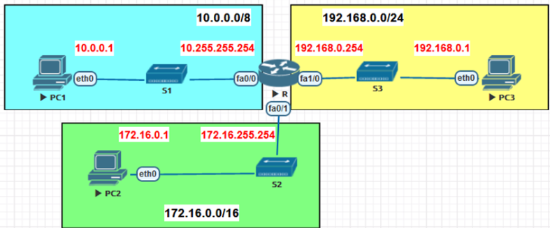
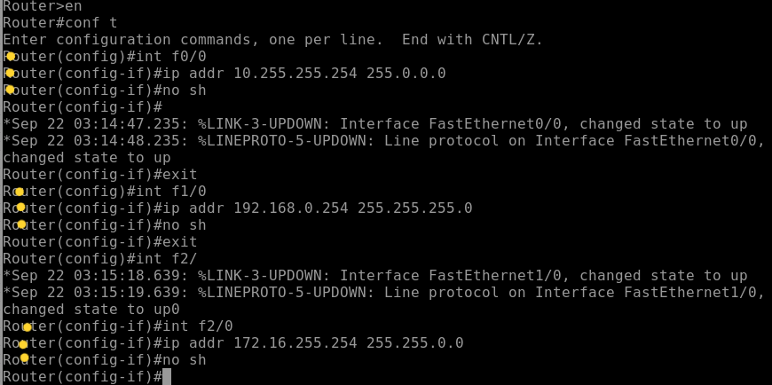

Router = a device that connects different networks and facilitates communication and data transfer between them. 
라우터 = 서로 다른 네트워크를 연결하여 통신과 데이터 전달을 수행하는 장치

(PNET) 
  

서로 다른 네트워크의 PC들을 서로 통신할 수 있게 라우터가 연결합니다. 
라우터 CLI에 각각의 네트워크 정보들을 입력합니다.

  

Enter the network configuration according to each interface 
각 인터페이스에 맞게 네트워크를 입력합니다. 
(f0/1 = f2/0, only here)
