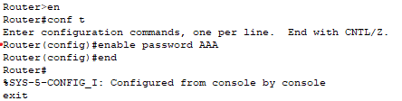
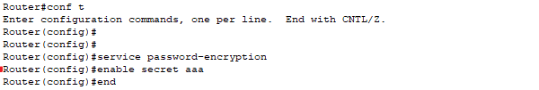
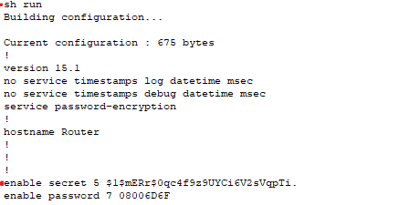
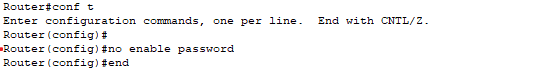
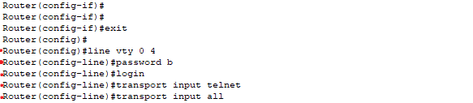
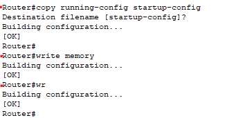

** Router Security  
 

(Packet Tracer) 

  
Set the password to AAA to enter privileged mode from user mode. 
사용자 모드에서 관리자 모드로에 진입비밀번호를 AAA로 설정합니다. 

   
The password is in uppercase letters. 
*비밀번호는 대문자입니다. 

 
 
 

  
When accessing the device physically or via Telnet, the password can be exposed in plain text. 
*장비에 물리적 접근 또는 Telnet 접속 환경에서는 비밀번호가 그대로 노출될 수 있다.

 
 
 

  
service password-encryption – Weak Encryption(Cisco Type 7)  
service password-encryption 약한 암호화
 
 
 

  
enable secret - MD5 Hash – Stronger Encryption (password=aaa) 
*MD5해시값으로 강한 암호화 

  
 
 
 
 
  

  
Even if no service password-encryption is configured, the passwords remain encrypted. 
*비밀번호 해제해도 그대로 암호화 되어있음 
no service password-encryption 복호화 안 됨.
 
 
 
 
  
Removing the enable password using no enable password. 
*no enable password 비밀번호 해제 

 
 
 

  

  
sh run = show running-config 
*Password removal completed.
 
 

  
line vty 0 4 – Virtual Terminal (VTY) lines for remote access, covering lines 0 through 4. 
line vty 0 4 :VTY 원격 접속용 가상 포트 0~4번 라인 

Set the VTY password to b for remote access. 
password b : VTY 접속 시 비밀번호를 b로 설정  

login – Enables password authentication for the line. 
login : 패스워드 인증 활성화  

transport input telnet – Allows only Telnet connections on the VTY lines. 
transport input telnet : VTY 라인에서 Telnet 접속만 허용  

transport input all – Allows all remote access protocols (for security, it is safer to allow only SSH). 
transport input all : 모든 원격 접속 프로토콜 허용 (SSH만 허용하는 것이 안전)

 

  
Attempted to connect to the router via Telnet from the PC and entered the password b, but access to privileged mode failed 
because the router has no enable password set. 
*PC로 라우터에 텔넷 접속 비밀번호 b 입력 그러나 라우터에 비밀번호가 없으므로 관리자 모드에 진입 불가 

  
** Save the running configuration from volatile memory (RAM) to non-volatile memory (NVRAM) so that the settings are retained even after a reboot. 
*휘발성 메모리(RAM)에서 동작 중인 설정을 비휘발성 메모리(NVRAM)에 저장해, 재부팅해도 설정을 유지 
 
 
  
** finger – Allows querying device information (typically disabled by default for security reasons). 
(Only available on actual Cisco routers or advanced simulators like GNS3/EVE-NG.) 
*finger : 장비 정보 조회 가능 (보안적으로 기본 차단되어있음)(실제 Cisco 라우터나 GNS3/EVE-NG 같은 고급 시뮬레이터에서만 사용 가능)

