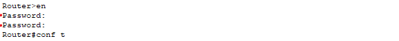
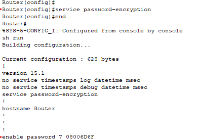
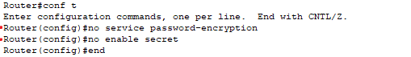

** Router Security  
 

  

Set the password to AAA to enter privileged mode from user mode. 
사용자 모드에서 관리자 모드로에 진입비밀번호를 AAA로 설정합니다. 

  
The password is in uppercase letters. 
비밀번호는 대문자입니다. 
 

  
When accessing the device physically or via Telnet, the password can be exposed in plain text. 
장비에 물리적 접근 또는 Telnet 접속 환경에서는 비밀번호가 그대로 노출될 수 있다.

  
Cisco Type 7 – Weak Encryption 
Cisco Type 7 약한 암호화 

  
MD5 Hash – Stronger Encryption 
MD5해시값 강한 암호화 

  
 
 
 
 
  

  
Even if no service password-encryption is configured, the passwords remain encrypted. 
no service password-encryption해도 그대로 암호화 되어있음 

  
Removing the enable password using no enable password. 
no enable password 비밀번호 해제 

  

  
sh run = show running-config

  
line vty 0 4 VTY 원격 접속용 가상 포트 0~4번 라인
password b VTY 접속 시 비밀번호를 b로 설정 
login 패스워드 인증 활성화
transport input telnet VTY 라인에서 Telnet 접속만 허용
transport input all 모든 원격 접속 프로토콜 허용 (SSH만 허용하는 것이 안전)
  

PC로 라우터에 텔넷 접속 비밀번호 b 입력 그러나 라우터에 비밀번호가 없으므로 관리자 모드에 진입 불가 

