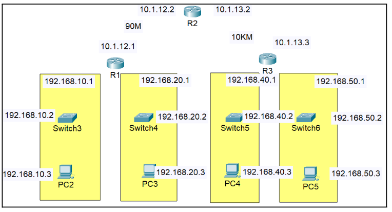
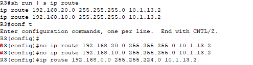

** Static Routing 정적라우팅 
 
 

(Packet Tracer) 
 
To enable communication between different networks, a router is used, and routes must be entered into the routing table.
Based on the distance, one side uses a UTP cable, while the other side uses a fiber-optic cable. 
서로 다른 대역들의 통신을 위해 라우터를 이용하는데 라우팅 테이블에 경로를 입력해야 합니다. 
거리를 보면 한 쪽은 UTP케이블 다른 쪽은 광케이블을 이용합니다. 

 

 

 
 
Enter them into each router. 
라우터에 각각 입력합니다. 

 
 
 

 
An IP address can also be assigned to a switch. The default interface is VLAN1. 
스위치에도 ip입력을 할 수 있습니다. 기본 인터페이스는 Vlan1입니다. 

 
After configuring the gateway, remote Telnet access can be enabled. 
게이트웨이를 입력 후 원격으로 telnet 접속하게 할 수 있습니다.  
** login local != login

 
 
 
 

 
**For more efficient network management, the two networks on the left can be combined. 
네트워크 관리 효율을 위해 왼쪽 두 개 대역을 축약할 수 있습니다. 

 
