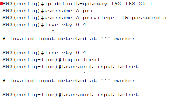

** Static Routing 정적라우팅 
 
 

(Packet Tracer) 
 
To enable communication between different networks, a router is used, and routes must be entered into the routing table.
Based on the distance, one side uses a UTP cable, while the other side uses a fiber-optic cable. 
서로 다른 대역들의 통신을 위해 라우터를 이용하는데 라우팅 테이블에 경로를 입력해야 합니다. 
거리를 보면 한 쪽은 UTP케이블 다른 쪽은 광케이블을 이용합니다. 

 

 

 
 
Enter them into each router. 
라우터에 각각 입력합니다. 

 
 
 

 
An IP address can also be assigned to a switch. The default interface is VLAN1. 
스위치에도 ip입력을 할 수 있습니다. 기본 인터페이스는 Vlan1입니다. 

It is also possible to convert a physical port to a routed port (using the no switchport command). 
** However, from this point, the device functions as a router, so routes must be registered in the routing table. 
- 물리 포트를 routed port로 변환도 가능(no switch port라는 명령어 이용) 
- 단, 이때부터 라우터 역할이므로 테이블 경로 등록해야함. 
-  
-  
-
-
-
-

 
 
 

 
After configuring the gateway, remote Telnet access can be enabled. 
게이트웨이를 입력 후 원격으로 telnet 접속하게 할 수 있습니다.  
** login local != login

 
 
 
 

 
**For more efficient network management, the two networks on the left can be combined. 
네트워크 관리 효율을 위해 왼쪽 두 개 대역을 축약할 수 있습니다. 

 
 
 
 
 

* For reference 참고 

*Security 보안

NTP Synchronization: Important for quickly identifying the cause in case of failures. 
NTP 동기화: 장애 발생 시 빠른 원인 파악에 중요 
Command: ntp server <IP> → Synchronizes the time between the server and the client. 
명령어: ntp server IP → 서버와 클라이언트 시간 일치
 
 
The AUX port is a auxiliary (backup) port. 예비 포트 
Switch(config)#line aux 0 
Switch(config-line)#transport input/output none 입출력 차단  
Switch(config-line)#no password 
Switch(config-line)#exec-timeout 0 1  ← Automatically logs out if there is no input for 1 second. 
&nbsp;&nbsp;&nbsp;&nbsp;&nbsp;&nbsp;&nbsp;&nbsp;&nbsp;&nbsp;&nbsp;&nbsp;&nbsp;&nbsp;&nbsp;&nbsp;&nbsp;&nbsp;&nbsp;&nbsp;&nbsp;&nbsp;&nbsp;&nbsp;&nbsp;&nbsp;&nbsp;&nbsp;&nbsp;&nbsp;&nbsp;&nbsp;&nbsp;&nbsp;&nbsp;&nbsp;&nbsp;&nbsp;&nbsp;&nbsp;&nbsp;&nbsp;&nbsp;&nbsp;&nbsp;&nbsp;&nbsp;&nbsp;&nbsp;&nbsp;&nbsp;&nbsp;&nbsp;&nbsp;&nbsp;&nbsp;&nbsp;&nbsp;&nbsp;&nbsp;&nbsp;&nbsp;&nbsp;&nbsp;1초 동안 입력 없으면 자동으로 로그아웃
