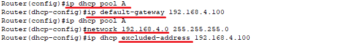
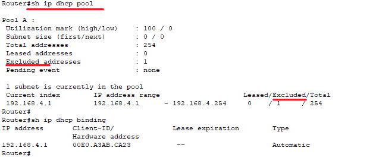
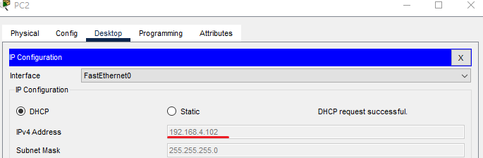
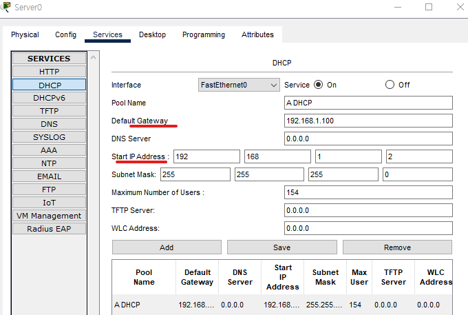
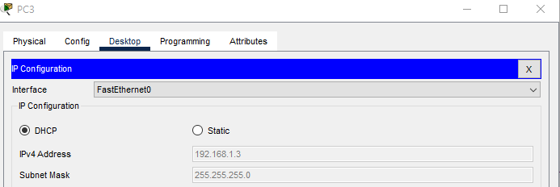
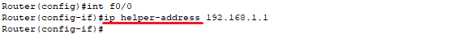

** DHCP  

A protocol that automatically assigns IP addresses and related configurations. 
IP 주소와 관련 설정을 자동으로 할당하는 프로토콜 

(Packet Tracer)

  
Trying to obtain an IP address from the router. 
라우터에게 ip를 할당 받으려고 합니다. 
 

  
 
Create a DHCP pool named 'A'. After entering the gateway, the gateway address is excluded from IP assignment. 
DHCP pool 생성을 해줘야합니다. 이름은 A입니다. 
게이트 웨이 입력 후, 게이트 웨이 주소는 제외합니다.

  

  
Change the PC from a static IP to DHCP. 
PC에서도 static에서 DCHP로 변경

  
이번엔 맨왼쪽 서버에서 ip할당을 받겠습니다.

  
Network settings must be configured according to each network. 
각 네트워크에 맞게 네트워크 설정을 해줘야 합니다. 

  

  
On the switch, after entering ip address dhcp on the default VLAN1, it automatically receives the information from the DHCP pool. 
스위치도 기본 vlan1에서 ip add dhcp 입력 후, 자동으로 pool의 정보를 받습니다.

  
If the networks are different, the server IP must be entered into the router. 
다른 대역일 경우, 라우터에 서버 ip를 입력해야 합니다. 

