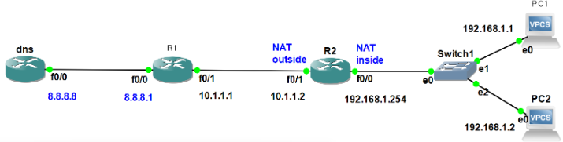
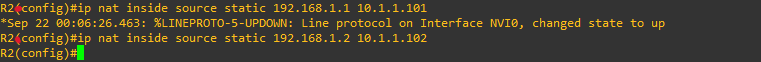
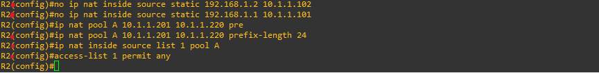
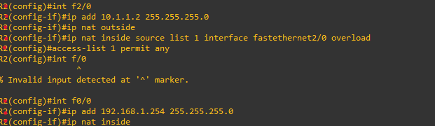

**NAT 

A technology that translates private IP addresses into public IP addresses. 
사설 IP 주소를 공인 IP 주소로 변환하는 기술 
 
 

*Security 

-Hides internal IP addresses → Enhances security. 
내부 IP를 숨김 → 보안성 향상  
-Converts multiple IP addresses into a single IP → Partially alleviates the problem of IP address exhaustion. 
여러 개의 IP를 하나의 IP로 변환 → 주소 고갈 문제 일정 부분 해소 
 
 

 Three types ;

 

(GNS3)

  

* Static NAT

  
When 192.168.1.1 goes out to the external network, it is translated to 10.1.1.101. 
When 192.168.1.2 goes out to the external network, it is translated to 10.1.1.102. 
192.168.1.1 가 외부로 나갈때, 10.1.1.101 로 변환 
192.168.1.2 가 외부로 나갈때, 10.1.1.102 로 변환 

* Dynamic NAT

  
Erase the previous configuration. 
기존 설정 삭제  
 

First, create a NAT pool. 
Next, apply NAT translation rules. 
Finally, specify internal IPs with an ACL. 

ㅡ NAT 풀 생성 
ㅡ NAT 변환 규칙 적용 
ㅡ ACL로 내부 IP 지정 

* PAT 

When no pool is used, each internal IP is distinguished by its external port number. 
*pool 없이 외부포트 번호로 (포트 번호 다르면 내부 IP 다름)

(GNS3)

  

  
First, configure the interface. 
Next, apply PAT (Port Address Translation). 
Finally, define an ACL (specifying the internal IP range for NAT). 

ㅡ 인터페이스 설정 
ㅡ PAT 적용 
ㅡ ACL정의 ( NAT 대상 내부 IP 범위)  

(f2/0 = f0/1,only here)
