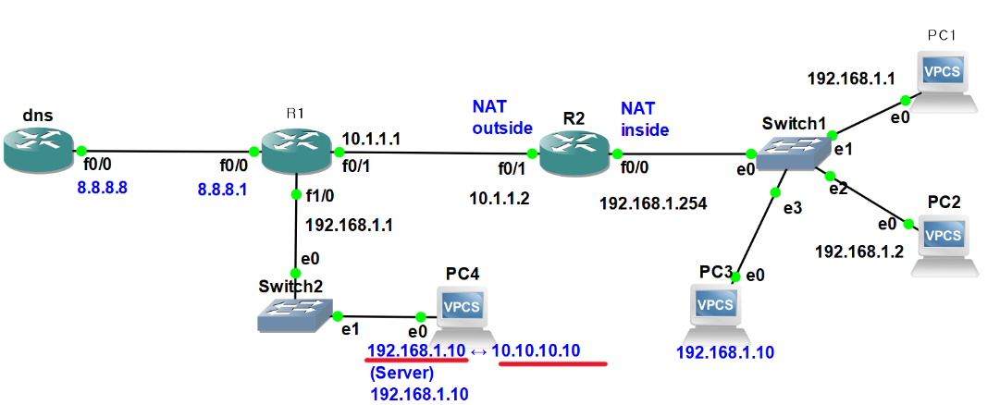
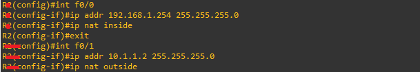
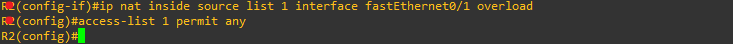
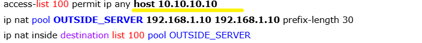
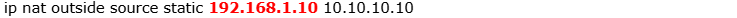

**Exception

Typically, address translation in the inside zone is used.  
In exceptional cases, the outside address translation method is applied. 
When identical IPs exist in both internal and external networks causing a conflict, internal traffic is translated to access the external server via a virtual IP. 
보통은 inside 영역의 주소 변환을 이용합니다. 예외적으로 outside 주소 변환 방식을 보겠습니다.  
내부와 외부에 동일한 IP가 있어 충돌이 발생할 경우, 내부에서는 외부 서버를 가상 IP로 접근하도록 변환합니다.

(GNS3)
  

*Current remaining configuration 
현재 남아있는 설정 
  

  
 

  
-Since the destination is predetermined, list-100 is used. (ACL rule) 
-Pool configuration 
-Packets with the destination set to 10.10.10.10 are translated to the actual address before being forwarded 

-목적지가 정해져 있기 때문에 list-100부터 사용합니다. (ACL 규칙) 
-풀 설정 
-목적지가 10.10.10.10 정해진 패킷을 실제 주소로 바뀌어 전달
 
 
 

  
192.168.1.10 is translated to appear as 10.10.10.10. 
192.168.1.10이 10.10.10.10으로 보이게 합니다. 
 
 

(MobaXterm)
  

Completed. 
변환 완료
