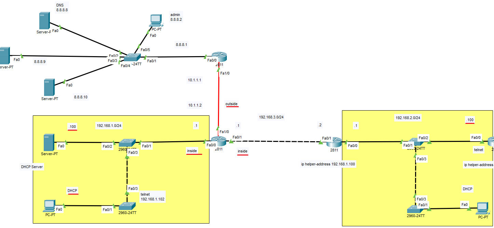
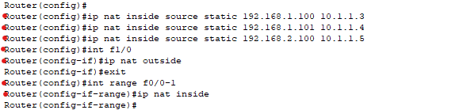

** NAT 
 
 

- Static 

(Packet Tracer)
  
first, set the IP address to be used for translation when traffic goes from internal to external. 
And then, configure the router’s external and internal interfaces accordingly. 
먼저, 내부에서 외부로 나갈 때 변환 될 IP를 설정 후, 라우터 기준 외부 및 내부 인터페이스 설정 

  
 
To undo it, use no ip nat inside source static. 
지울 때는 no ip nat insde source static [IP주소]

 
 
 
 
 

- Dynamic 
 

(Packet Tracer)

  
First, create a NAT pool (name it 'B')  
Next, create an ACL (Access Control List)  
Finally, apply dynamic NAT using the pool. 

ㅡ NAT 풀 생성 (이름 B) 
ㅡ ACL 생성 
ㅡ 동적 NAT 풀 적용 
 
 
 
 

- PAT 

When no pool is used, each internal IP is distinguished by its external port number. 
*pool 없이 외부포트 번호로 (포트 번호 다르면 내부 IP 다름)

(GNS3)

  

  

